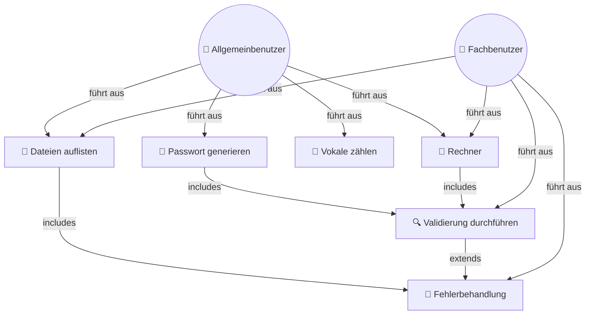

```mermaid
graph TD
  %% Definition der Akteure
  Allgemeinbenutzer(("👤 Allgemeinbenutzer"))
  Fachbenutzer(("👤 Fachbenutzer"))

  %% Definition der Anwendungsfälle
  UC1["🔑 Passwort generieren"]
  UC2["📂 Dateien auflisten"]
  UC3["📝 Vokale zählen"]
  UC4["🧮 Rechner"]
  UC5["🔍 Validierung durchführen"]
  UC6["📌 Fehlerbehandlung"]

  %% Erweiterungen & Includes
  UC1 -->|includes| UC5
  UC2 -->|includes| UC6
  UC4 -->|includes| UC5
  UC5 -->|extends| UC6

  %% Verknüpfung der Akteure mit Anwendungsfällen
  Allgemeinbenutzer -->|führt aus| UC1
  Allgemeinbenutzer -->|führt aus| UC2
  Allgemeinbenutzer -->|führt aus| UC3
  Allgemeinbenutzer -->|führt aus| UC4

  Fachbenutzer -->|führt aus| UC2
  Fachbenutzer -->|führt aus| UC4
  Fachbenutzer -->|führt aus| UC5
  Fachbenutzer -->|führt aus| UC6
```
