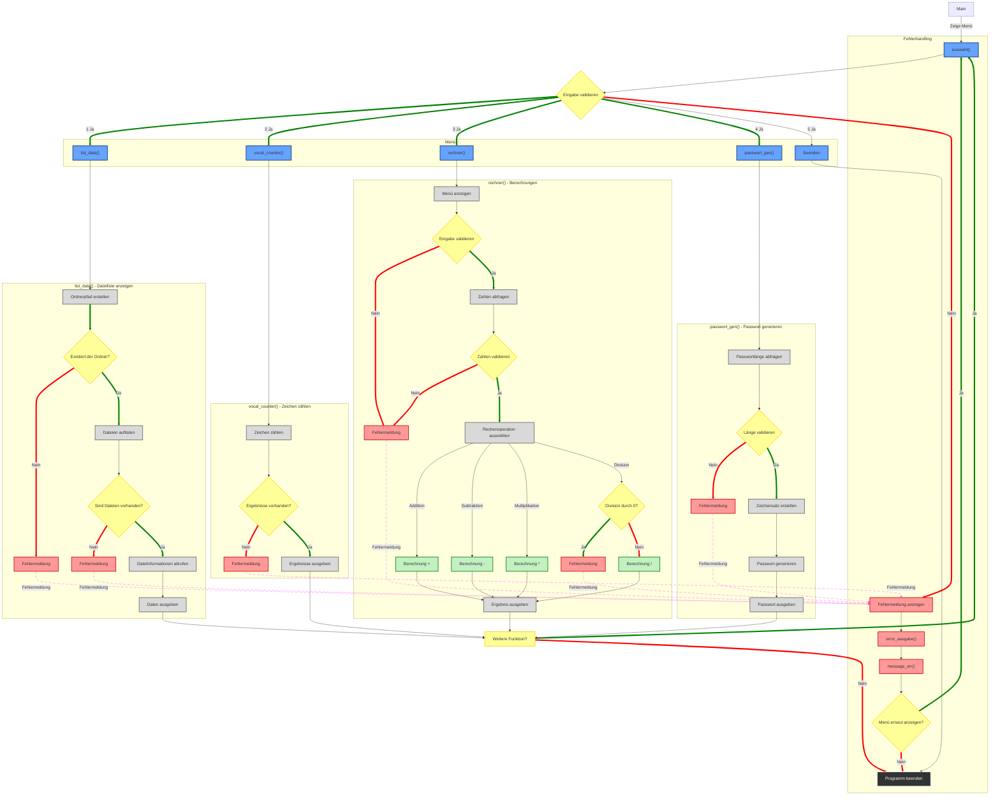

```mermaid
graph TD
    %% Hauptprogramm (Main)
    A1["Main"] -->|Zeige Menü| A2["auswahl()"]:::menu
    A2 --> A3{"Eingabe validieren"}:::decision
    
    A3 -- Nein --> A5["Fehlermeldung anzeigen"]:::error
    A3 -- 1 Ja -->B1:::execute
    A3 -- 2 Ja -->B2:::execute
    A3 -- 3 Ja -->B3:::execute
    A3 -- 4 Ja -->B4:::execute
    A3 -- 5 Ja -->B5:::execute

    %% Menü Auswahl
    subgraph "Menü"
        B1["list_data()"]:::menu
        B2["vocal_counter()"]:::menu
        B3["rechner()"]:::menu
        B4["passwort_gen()"]:::menu
        B5["Beenden"]:::menu
    end

    %% Datei-Liste anzeigen
    subgraph "list_data() - Dateiliste anzeigen"
        B1 --> C1["Ordnerpfad erstellen"]:::execute
        C1 --> C2{"Existiert der Ordner?"}:::decision
        C2 -- Nein --> C3["Fehlermeldung"]:::error
        C2 -- Ja --> C4["Dateien auflisten"]:::execute
        C4 --> C5{"Sind Dateien vorhanden?"}:::decision
        C5 -- Nein --> C6["Fehlermeldung"]:::error
        C5 -- Ja --> C7["Dateiinformationen abrufen"]:::execute
        C7 --> C8["Daten ausgeben"]:::execute

    end

    %% Zeichen-Zähler
    subgraph "vocal_counter() - Zeichen zählen"
        B2 --> D1["Zeichen zählen"]:::execute
        D1 --> D2{"Ergebnisse vorhanden?"}:::decision
        D2 -- Nein --> D3["Fehlermeldung"]:::error
        D2 -- Ja --> D4["Ergebnisse ausgeben"]:::execute

    end

    %% Rechner mit vier separaten Strängen
    subgraph "rechner() - Berechnungen"
        B3 --> E1["Menü anzeigen"]:::execute
        E1 --> E2{"Eingabe validieren"}:::decision
        E2 -- Nein --> E3["Fehlermeldung"]:::error
        E2 -- Ja --> E4["Zahlen abfragen"]:::execute
        E4 --> E5{"Zahlen validieren"}:::decision
        E5 -- Nein --> E3
        E5 -- Ja --> E6["Rechenoperation auswählen"]:::execute

        E6 --> |Addition| R5["Berechnung +"]:::math
        E6 -->|Subtraktion| R6["Berechnung -"]:::math
        E6 -->|Multiplikation| R7["Berechnung *"]:::math
        E6 -->|Division| R4{"Division durch 0?"}:::decision

        R5 --> E10["Ergebnis ausgeben"]:::execute
        R6 --> E10
        R7 --> E10

        R4 -- Ja --> R8["Fehlermeldung"]:::error
        R4 -- Nein --> R9["Berechnung /"]:::math
        R9 --> E10

        
    end

    %% Passwort-Generator
    subgraph "passwort_gen() - Passwort generieren"
        B4 --> F1["Passwortlänge abfragen"]:::execute
        F1 --> F2{"Länge validieren"}:::decision
        F2 -- Nein --> F3["Fehlermeldung"]:::error
        F2 -- Ja --> F4["Zeichensatz erstellen"]:::execute
        F4 --> F5["Passwort generieren"]:::execute
        F5 --> F6["Passwort ausgeben"]:::execute
        
    end

    %% Fehlerbehandlung
    subgraph "Fehlerhandling" 
    direction LR
        A5["Fehlermeldung anzeigen"] --> G1["error_ausgabe()"]:::error
        G1 --> G2["message_err()"]:::error
        G2 --> G3{"Menü erneut anzeigen?"}:::decision
        G3 -- Ja --> A2
        G3 -- Nein --> A7
    end

    %% Entscheidung: Weitere Funktion oder beenden
    X1["Weitere Funktion?"]:::decision
    X1 -- Ja --> A2
    X1 -- Nein --> A7
    C8 --> X1
    D4 --> X1
    F6 --> X1
    E10 --> X1
    B5 --> A7
    A7["Programm beenden"]:::ende

    %% Fehlermeldungsstrang von allen Fehlern ausgehend
    C3 -->|Fehlermeldung| A5
    C6 -->|Fehlermeldung| A5
    D3 -->|Fehlermeldung| A5
    E3 -->|Fehlermeldung| A5
    R8 -->|Fehlermeldung| A5
    F3 -->|Fehlermeldung| A5

    %% Stilklassen für die Farben
    classDef menu fill:#66a3ff,stroke:#003366,stroke-width:2px;
    classDef execute fill:#d9d9d9,stroke:#666666,stroke-width:2px;
    classDef decision fill:#ffff99,stroke:#ffcc00,stroke-width:2px;
    classDef error fill:#ff9999,stroke:#cc0000,stroke-width:2px;
    classDef math fill:#c2f0c2,stroke:#008000,stroke-width:2px;
    classDef ende fill:#333333,stroke:#ffffff,stroke-width:2px,color:#ffffff;

    %% Link Stile für JA (Grün) und NEIN (Rot)
    linkStyle 3,4,5,6,9,11,14,19,23,34,26,40,46,48 stroke:#008000,stroke-width:5px;
    linkStyle 2,10,13,18,22,25,35,39,47,49 stroke:#FF0000,stroke-width:5px;
    linkStyle 55,56,57,58,59,60 stroke:#FF50f0,stroke-dasharray: 10px 6px;

```
