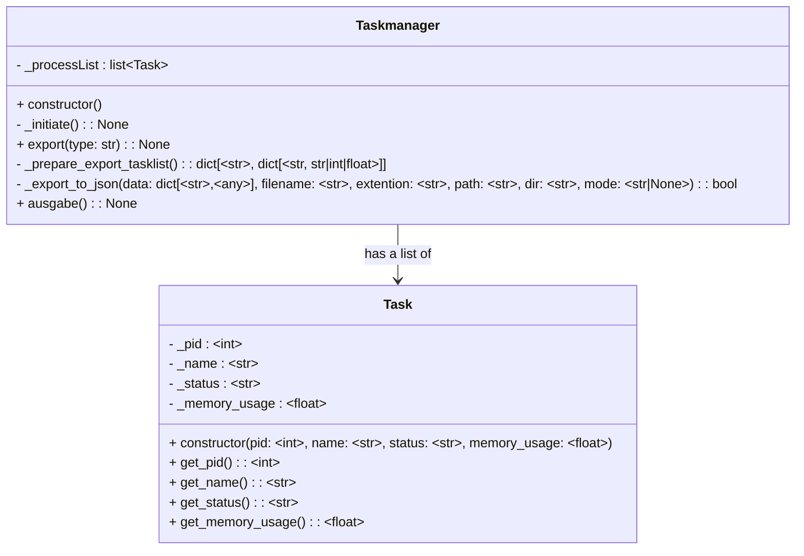

```mermaid
classDiagram
    class Task {
        - _pid : ~int~
        - _name : ~str~
        -  _status : ~str~
        - _memory_usage : ~float~
        + constructor(pid: ~int~, name: ~str~, status: ~str~, memory_usage: ~float~)
        + get_pid(): ~int~
        + get_name(): ~str~
        + get_status(): ~str~
        + get_memory_usage(): ~float~
    }

    class Taskmanager {
        -  _processList : list~Task~
        + constructor()
        - _initiate(): None
        + export(type: str): None
        - _prepare_export_tasklist(): dict[~str~, dict[~str, str|int|float~]]
        - _export_to_json(data: dict[~str~,~any~], filename: ~str~, extention: ~str~, path: ~str~, dir: ~str~, mode: ~str|None~): bool
        + ausgabe(): None
    }

    Taskmanager --> Task : has a list of


```
