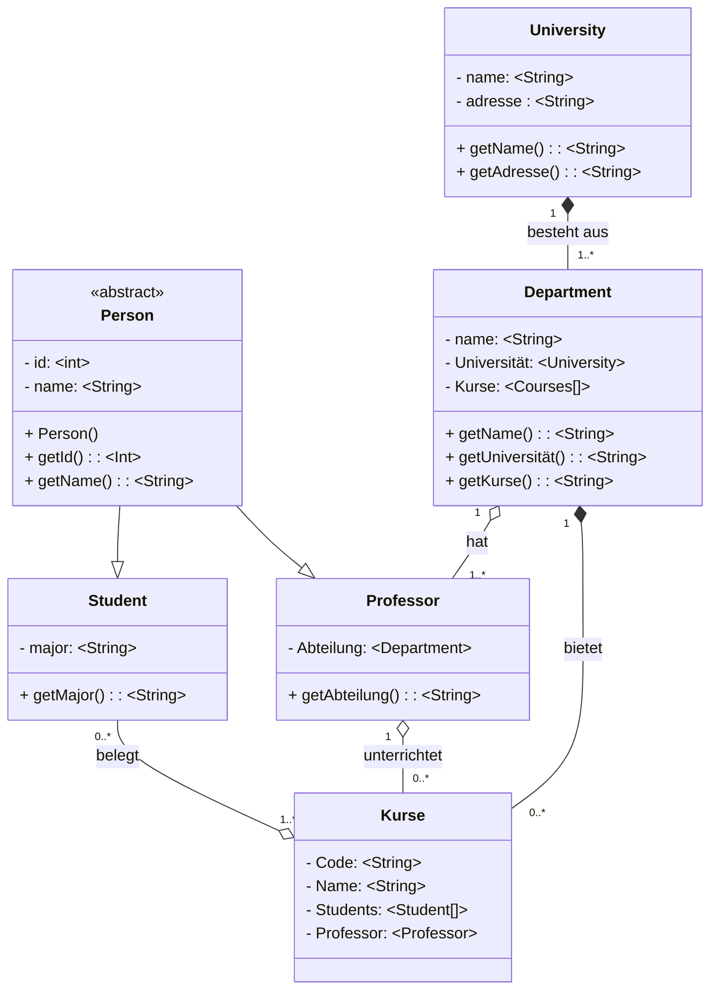
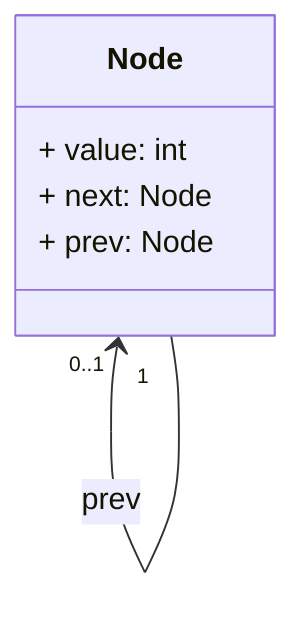

```mermaid
classDiagram
    %% Abstrakte Klasse Person
    class Person {
      <<abstract>>
      - id: ~int~
      - name: ~String~
      + Person()
      + getId(): ~Int~
      + getName(): ~String~
    }

    class Student {
      - major: ~String~
      + getMajor(): ~String~
    }

    class Professor {
      - Abteilung: ~Department~
      + getAbteilung(): ~String~
    }

    Person --|> Student
    Person --|> Professor

    %% Universität und Abteilungen
    class University {
      - name: ~String~
      - adresse : ~String~
      + getName(): ~String~
      + getAdresse(): ~String~
    }

    class Department {
      - name: ~String~
      - Universität: ~University~
      - Kurse: ~Courses[]~
      + getName(): ~String~
      + getUniversität(): ~String~
      + getKurse(): ~String~
    }

    University "1" *-- "1..*" Department : besteht aus

    %% Aggregation: Department und Professor
    Department "1" o-- "1..*" Professor : hat

    %% Kurse
    class Kurse {
      - Code: ~String~
      - Name: ~String~
      - Students: ~Student[]~
      - Professor: ~Professor~
    }

    %% Assoziationen: Department bietet Kurse an
    Department "1" *-- "0..*" Kurse : bietet

    %% Assoziation: Professor unterrichtet Kurse
    Professor "1" o-- "0..*" Kurse : unterrichtet

    %% Assoziation: Student belegt Kurse
    Student "0..*" --o "1..*" Kurse : belegt


```

```mermaid
classDiagram
    class Node {
      + value: int
      + next: Node
      + prev: Node
    }

    %% Darstellung der Selbstbeziehung (zum Beispiel für "next")
    Node "1" --> "0..1" Node : next
    Node "0..1" <-- "1" Node : prev

```
