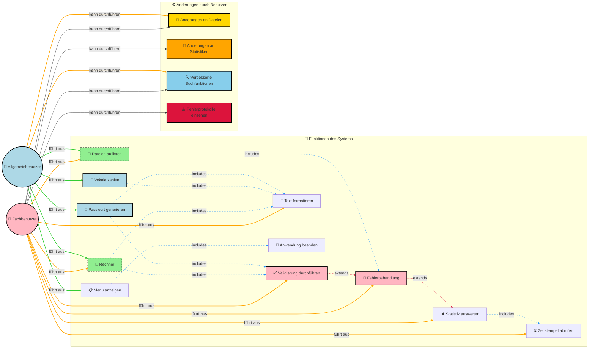

```mermaid
graph LR

  %% Akteure mit Farben
  Allgemeinbenutzer(("👤 Allgemeinbenutzer"))
  Fachbenutzer(("👤 Fachbenutzer"))

  %% Haupt-Anwendungsfälle
  subgraph "🔧 Funktionen des Systems"
    direction LR
    UC1["🔑 Passwort generieren"]
    UC2["📂 Dateien auflisten"]
    UC3["📝 Vokale zählen"]
    UC4["🧮 Rechner"]
    UC5["✅ Validierung durchführen"]
    UC6["📌 Fehlerbehandlung"]
    UC7["📊 Statistik auswerten"]
    UC8["📜 Text formatieren"]
    UC9["⏳ Zeitstempel abrufen"]
    UC10["📋 Menü anzeigen"]
    UC11["🛑 Anwendung beenden"]
  end

  %% Erweiterungen & Includes (mit optischer Unterscheidung)
  UC1 --->|includes| UC5
  UC1 --->|includes| UC8
  UC2 --->|includes| UC6
  UC3 --->|includes| UC8
  UC4 --->|includes| UC5
  UC4 --->|includes| UC8
  UC5 -->|extends| UC6
  UC6 -->|extends| UC7
  UC7 --->|includes| UC9
  UC10 --->|includes| UC11

  %% Akteur-Zuweisung (führt aus)
  Allgemeinbenutzer -->|führt aus| UC1
  Allgemeinbenutzer -->|führt aus| UC2
  Allgemeinbenutzer -->|führt aus| UC3
  Allgemeinbenutzer -->|führt aus| UC4
  Allgemeinbenutzer -->|führt aus| UC10

  Fachbenutzer -->|führt aus| UC2
  Fachbenutzer -->|führt aus| UC4
  Fachbenutzer -->|führt aus| UC5
  Fachbenutzer -->|führt aus| UC6
  Fachbenutzer -->|führt aus| UC7
  Fachbenutzer -->|führt aus| UC8
  Fachbenutzer -->|führt aus| UC9

  %% Änderungen, die Benutzer durchführen dürfen
  subgraph "⚙️ Änderungen durch Benutzer"
    direction LR
    A1["📝 Änderungen an Dateien"]
    A2["🔄 Änderungen an Statistiken"]
    A3["🔍 Verbesserte Suchfunktionen"]
    A4["⚠️ Fehlerprotokolle einsehen"]
  end

  %% Verknüpfungen der Änderungen mit Benutzergruppen (kann durchführen)
  Allgemeinbenutzer -->|kann durchführen| A1
  Allgemeinbenutzer -->|kann durchführen| A3

  Fachbenutzer --->|kann durchführen| A1
  Fachbenutzer --->|kann durchführen| A2
  Fachbenutzer --->|kann durchführen| A3
  Fachbenutzer --->|kann durchführen| A4

  %% Farben für Akteure
  style Allgemeinbenutzer fill:#ADD8E6,stroke:#000,stroke-width:2px
  style Fachbenutzer fill:#FFB6C1,stroke:#000,stroke-width:2px

  %% Farben für Funktionen
  style UC1 fill:#ADD8E6,stroke:#000,stroke-width:2px
  style UC3 fill:#ADD8E6,stroke:#000,stroke-width:2px
  style UC5 fill:#FFB6C1,stroke:#000,stroke-width:2px
  style UC6 fill:#FFB6C1,stroke:#000,stroke-width:2px
  style UC2 fill:#90EE90,stroke:#000,stroke-dasharray: 5 5
  style UC4 fill:#90EE90,stroke:#000,stroke-dasharray: 5 5

  %% Farben für Änderungen
  style A1 fill:#FFD700,stroke:#000,stroke-width:2px
  style A2 fill:#FFA500,stroke:#000,stroke-width:2px
  style A3 fill:#87CEEB,stroke:#000,stroke-width:2px
  style A4 fill:#DC143C,stroke:#000,stroke-width:2px

  %% Styles für Includes (gestrichelt, Blau) und Extends (gepunktet, Rot)
  linkStyle 0,1,2,3,4,5,8,9 stroke:#1E90FF,stroke-dasharray: 5 5
  linkStyle 6,7 stroke:#DC143C,stroke-dasharray: 3 3

  %% Styles für "führt aus" (grün) und "kann durchführen" (orange)
  linkStyle 10,11,12,13,14 stroke:#32CD32,stroke-width:2px
  linkStyle 15,16,17,18,19,20,21,22,23 stroke:#FFA500,stroke-width:2px
```
